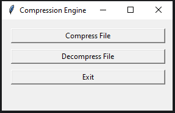

# File Compression App

## Overview

This project is a File Compression App built with Python and Tkinter.
It allows you to compress and decompress text files using **zlib** and **Base64**.
The user can interact with the application using the **GUI**.

## Features

- **File Compression:** Compress test files into a smaller, ASCII-safe format using zlib and Base64.
- **File Decompression** Decompress files that were compressed.
- **GUI:** A user-friendly interface build with Tkinter.